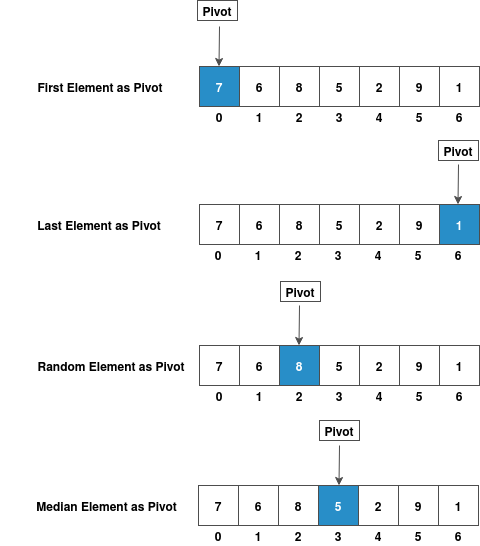

### How to Select Pivot?

QuickSort is a Divide and Conquer algorithm. It picks an element as pivot and partitions the given array around the picked pivot.

There are many different versions of Quick Sort that pick pivot in different ways :

   - Always pick first element as pivot
   - Always pick last element as pivot
   - Pick a random element as pivot
   - Pick median as pivot

### Pictorial Representation of Pivot Selection 

### Partitioning of the Array

The key process in Quick Sort is partition. Targets of partitions is, given an array and an element x of array as pivot, put x at its correct position in sorted array and put all smaller and equal elements (smaller than or equal to x) before x, and put all greater elements (greater than x) after x.

Partitioning array around the pivot means we divide the array into three parts

   - **Partition-1** : Contains all elements of that array less than or equal to pivot
   - **Partition-2** : Contains only pivot
   - **Partition-3** : Contains all elements of that array greater than pivot

### Steps to Partition an Unsorted Array

   - STEP 1 : First select a pivot in an unsorted array as shown above in the pivot selection section
   - STEP 2 : Initialize the low index and high index. Low index represents the first index of an array. High index represents the last index of an array.
   - STEP 3 : Start comparing low index element and high index element with the pivot. First start comparing with low index element with pivot element.
      - If low index element is less than the pivot element, increment low index otherwise start comparing high index element with pivot element.
      - If high index element is greater than pivot element, decrement high index otherwise stop.
   - STEP 4 : Compare low index with high index.
      - If low index is less than high index swap low index element with the high index element.
      - If low index is greater than high index swap high index element with pivot index element.
   - STEP 5 : Repeat the steps 1 to 4 recursively for the sub-arrays until we get a sorted array.

### Pictorial Representation of Partitioning Unsorted Array 

