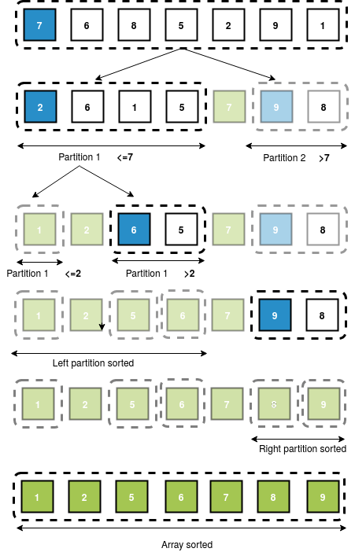

### What is Recursion?

On the given array we have to perform partition on that array and recursively on partition-1 and partition-3. But we have to stop at some point i.e., we will stop when the partition is already sorted. Remember that array containing one element is always sorted. So, we proceed till the partition is of length one.
### What is Concatenation?
After all sub-arrays(partitions and their partitions and so on) are sorted, we concatenate(place one after the other) all sub-arrays according to their indices and that gives us the sorted-array.

### Pictorial Representation of Sorting Array with Quick Sort 

