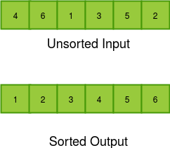

### Learning Objectives of the Experiment

In this experiment, we will be able to do the following:

  -  Given an unsorted array of numbers, generate a sorted array of numbers by applying Quick Sort.
  - Given an unsorted array of numbers, we will understand how to partition an array. This is an important concept in Quick Sort which is used recursively on the partitioned arrays to sort the numbers.

### Pictorial Representation of Unsorted and Sorted arrays 

### Importance of Sorting in Real Life

Here are the examples where the sorting can be used in real life, to make the data easy to visualize and retreive it faster.

   - **Searching** : Binary search enables you to test whether an item is in a dictionary in O (log n) time, once the keys are all sorted. Search pre-processing is perhaps the single most important application of sorting.

   - **Closest pair** : To find the closest pair of numbers. Given a set of n numbers, how do you find the pair of numbers that have the smallest difference between them? After the numbers are sorted, the closest pair of numbers will lie next to each other somewhere in sorted order.
    
*Example : The dictionary stores words in an alphabetical order so that searching of any word becomes easy (sorting un alphabetical order).*

   - **Books in library**: In library the books will be sorted according to the name of book or topic so, that we can access them faster.

### Types of Sorting Techniques or Algorithms

Sorting can be performed using various techniques/algorithms. Here are some of the most widely used techniques/algorithms to sort the data based on the type of requirement. Each one has its pros and cons. We need to know which best suits for our requirement in order to sort the data in most efficient way.

  -  Quick Sort
  -  Bubble Sort
  -  Selection Sort
  -  Merge Sort
  -  Heap Sort
  -  Radix Sort

### Categories of Sorting

The sorting techniques/algorithms can be divided into following categories :

   - **Stable and Unstable Sorting Algorithm**

    Stable Sorting Algorithm : If a sorting algorithm, after sorting the contents, does not change the sequence of similar content in which they appear, it is called stable sorting.
    Example : Bubble Sort, Merge Sort and Radix Sort

    Unstable Sorting Algorithm : If a sorting algorithm, after sorting the contents, changes the sequence of similar content in which they appear, it is called unstable sorting.
    Example : Quick Sort, Selection Sort and Heap Sort
   - **In-place and not In-place Sorting Algorithm**

    In-place Sorting Algorithm : Sorting algorithms may require some extra space for comparison and temporary storage of few data elements. These algorithms do not require any extra space and sorting is said to happen in-place, or for example, within the array itself. This is called in-place sorting.
    Example : Quick Sort, Bubble Sort, Selection Sort and Heap Sort

    Not In-place Sorting Algorithm : However, in some sorting algorithms, the program requires space which is more than or equal to the elements being sorted. Sorting which uses equal or more space is called not-in-place sorting.
    Example : Merge Sort
   - **Adaptive and Non-adaptive Sorting Algorithm**

    Adaptive Sorting Algorithm : A sorting algorithm is said to be adaptive, if it takes advantage of already 'sorted' elements in the list that is to be sorted. That is, while sorting if the source list has some element already sorted, adaptive algorithms will take this into account and will try not to re-order them.  
    Example : Bubble Sort and Quick Sort

    Non-adaptive Sorting Algorithm : A sorting algorithm is said to be adaptive, if it takes advantage of already 'sorted' elements in the list that is to be sorted. That is, while sorting if the source list has some element already sorted, adaptive algorithms will take this into account and will try not to re-order them. 
    
 Example : Selection Sort, Merge Sort and Heap Sort

### What is Time and Space Complexity ?

Time complexity of an algorithm gives the measure of time taken by it to run as a function of the length of the input. Similarly, Space complexity of an algorithm quantifies the amount of space or memory taken by an algorithm to run as a function of the length of the input. Recall that suppose our input is an array of N elements, and our algorithm iterates through the array once, time complexity will be O(N). If I run two embedded loops to traverse the array N times, time complexity will be O(N2).

### Estimated Time for Pre Test Quiz

10 minutes
### Instructions for Pre Test Quiz

   - Pretest includes questions on sorting, time complexity and space complexity.
   - If you want to revise these topics before taking the quiz, go through the Recap module first.
   - Read the questions in the quiz section and select the correct option from the ones provided. Please note that some questions may have more than one correct response.

