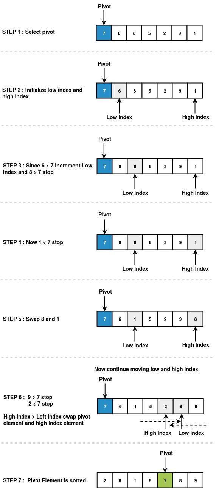
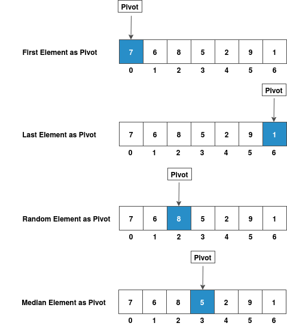

### Pivot Selection in QuickSort

QuickSort is a **Divide and Conquer algorithm** that works by selecting a 'pivot' element and partitioning the array around it. The choice of pivot significantly affects the algorithm's performance.

#### Common Pivot Selection Strategies

1. **First Element as Pivot**

   - Simple to implement
   - Poor performance on already sorted arrays

2. **Last Element as Pivot**

   - Most commonly used in implementations
   - Easy to understand and code

3. **Random Element as Pivot**

   - Provides good average-case performance
   - Helps avoid worst-case scenarios

4. **Median as Pivot**
   - Best theoretical choice
   - Requires additional computation to find median

#### Pictorial Representation of Pivot Selection

---

### Array Partitioning Process

**Goal:** Given an array and a pivot element, rearrange the array so that:

- All elements ≤ pivot are on the left
- The pivot is in its correct sorted position
- All elements > pivot are on the right

#### Three-Part Division

After partitioning, the array is divided into three sections:

| **Partition 1**  | **Partition 2** | **Partition 3**  |
| ---------------- | --------------- | ---------------- |
| Elements ≤ pivot | Pivot element   | Elements > pivot |

---

### Partitioning Algorithm Steps

#### Step 1: Select Pivot

Choose a pivot using one of the strategies mentioned above.

#### Step 2: Initialize Pointers

- **Low index (i)**: Points to the first element
- **High index (j)**: Points to the last element (excluding pivot if it's the last element)

#### Step 3: Compare and Move Pointers

**From the left (low index):**

- If `array[i] ≤ pivot`, move `i` forward
- If `array[i] > pivot`, stop

**From the right (high index):**

- If `array[j] > pivot`, move `j` backward
- If `array[j] ≤ pivot`, stop

#### Step 4: Swap or Place Pivot

- **If `i < j`**: Swap `array[i]` and `array[j]`, then repeat Step 3
- **If `i ≥ j`**: Partitioning is complete, place pivot at correct position

#### Step 5: Recursive Calls

Apply QuickSort recursively to both sub-arrays (left and right of the pivot).

---

### Example Walkthrough

**Initial Array:** `[64, 34, 25, 12, 22, 11, 90]`  
**Pivot:** `90` (last element)

1. **Initialize:** `i = 0`, `j = 5` (pointing to 11)
2. **Compare:** Move pointers until elements need swapping
3. **Partition:** After processing: `[64, 34, 25, 12, 22, 11, 90]`
4. **Result:** All elements ≤ 90 are on the left, 90 is in correct position

#### Pictorial Representation of Partitioning Process

---

### Key Points to Remember

✅ **Partitioning is the core operation** in QuickSort  
✅ **Pivot choice affects performance** - random selection often works well  
✅ **In-place partitioning** uses constant extra space  
✅ **After partitioning**, pivot is in its final sorted position  
✅ **Recursively apply** to sub-arrays on both sides of pivot

---

### Time Complexity

- **Best/Average Case:** O(n log n) - when pivot divides array roughly equally
- **Worst Case:** O(n²) - when pivot is always the smallest/largest element
- **Space Complexity:** O(log n) - due to recursive call stack
